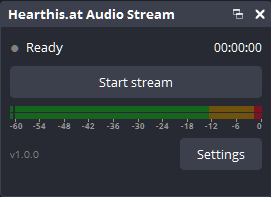
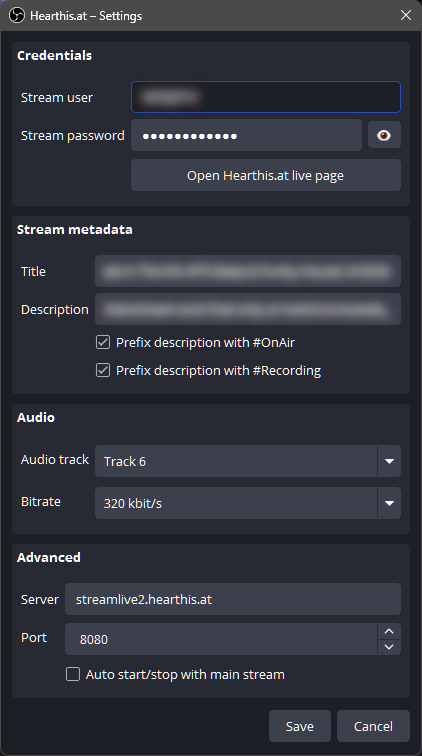

# Hearthis.at Audio Stream — OBS Studio Plugin

Stream any OBS audio track straight to your [hearthis.at](https://hearthis.at) live stream — audio-only, MP3 over Icecast, using the FFmpeg libraries that already ship with OBS. No external `ffmpeg.exe`, no second encoder, fully independent of your main stream and recording.

The plugin adds its own dock to OBS Studio (**Docks → Hearthis.at Audio Stream**) with a start/stop button, status indicator, live timer, outgoing bitrate and a true-peak level meter of the track being sent.






## Features

- **Own dock** with start/stop button, status indicator (Ready / Connecting / **LIVE** / Reconnecting / Error), live timer and the actual outgoing bitrate
- **Send any OBS audio track (1–6)** — pick the track in the settings and route sources to it via *Edit → Advanced Audio Properties* (e.g. music only, without your mic)
- **True-peak stereo level meter** of the selected track, styled exactly like the OBS mixer meters (follows your OBS theme) — also works while not streaming
- **MP3 encoding (32–320 kbit/s, default 192)** and **Icecast push** done in-process by OBS's bundled FFmpeg
- **Stream metadata**: title and description, with optional `#OnAir` / `#Recording` prefixes
- **Auto-reconnect** on connection loss (up to 20 attempts, live status in the dock)
- **Auto start/stop** together with your main OBS stream (optional)
- Runs happily alongside your normal stream and recording — separate output, separate audio mix

## Requirements

- **OBS Studio 31.0 or newer, 64-bit** (built against 31.1.1, tested on 32.1.2)
- **Windows 10/11 x64** — the code itself is platform-neutral, but macOS/Linux builds are currently untested
- A free [hearthis.at](https://hearthis.at) account

> **Note on OBS updates:** the plugin links against the FFmpeg 7 libraries (`avformat-61`) shipped with OBS 31/32. If a future OBS release bumps its FFmpeg major version, the plugin will need a rebuild — watch the releases page.

## Installation (Windows)

1. Download `obs-hearthis-audio-<version>-windows-x64.zip` from the [releases page](../../releases).
2. Close OBS.
3. Extract the ZIP into `C:\ProgramData\obs-studio\plugins` (create the folder if it doesn't exist). You should end up with:
   `C:\ProgramData\obs-studio\plugins\obs-hearthis-audio\bin\64bit\obs-hearthis-audio.dll`
4. Start OBS — the dock appears under **Docks → Hearthis.at Audio Stream**.

Tip: `ProgramData` is a hidden folder — just paste the path into the Explorer address bar.

## Setup

1. Log in at hearthis.at and open the [live streaming page](https://hearthis.at/live/#audio-only) — it shows your personal **stream user** and **stream password**. (The settings dialog has a button that takes you there.)
2. In the dock, open **Settings** and enter the stream user and password.
3. Pick the **audio track** to send and a **bitrate**.
4. Optional: stream title and description, `#OnAir`/`#Recording` prefix, auto start/stop with the main stream.
5. **Save**, then **Start stream**. Once the indicator shows **LIVE**, your stream is up on hearthis.at.

Which sources are audible on the stream is controlled per track in **Edit → Advanced Audio Properties** — enable the chosen track number for every source that should reach hearthis.at.

## Good to know

- Settings live in `%APPDATA%\obs-studio\plugin_config\obs-hearthis-audio\config.json`. The stream password is stored **in plain text** (just like stream keys in OBS profiles) — treat the file accordingly.
- Server and port (under *Advanced*) are pre-set for hearthis.at (`streamlive2.hearthis.at:8080`); the Icecast mount is derived automatically from your stream user. You only need to touch these if hearthis.at changes its infrastructure.
- Settings changed while streaming take effect on the next start.

## Building from source

The project uses the official [obs-plugintemplate](https://github.com/obsproject/obs-plugintemplate) build system (Visual Studio 2022, CMake ≥ 3.28):

```powershell
cmake --preset windows-x64        # downloads OBS/Qt/FFmpeg dependencies automatically
cmake --build --preset windows-x64
cmake --install build_x64 --config RelWithDebInfo --prefix C:\ProgramData\obs-studio\plugins
```

GitHub Actions workflows for CI builds and release packaging are included (from the template).

## Transparency: AI-assisted development

This plugin was written almost entirely by an AI coding assistant (Anthropic's Claude), working under human direction. The feature set, architecture decisions, code review and **all live testing against hearthis.at** were done by a human ([Scarala](https://github.com/Scarala)); the C++/Qt/FFmpeg code itself is AI-generated. If AI-written code matters to you — for trust, curiosity or licensing reasons — you now know, and the full source is here to inspect. Bug reports and pull requests are welcome either way.

## Credits & license

- Built on the [OBS Studio](https://obsproject.com) API and the official OBS plugin template — thanks to the OBS Project
- The dock level meter is a port of OBS Studio's `VolumeMeter` widget (GPL-2.0-or-later), so it matches the mixer look 1:1
- Successor to my earlier OBS Python script that drove an external `ffmpeg.exe` for the same job
- License: **GPL-2.0-or-later** — see [LICENSE](LICENSE)
